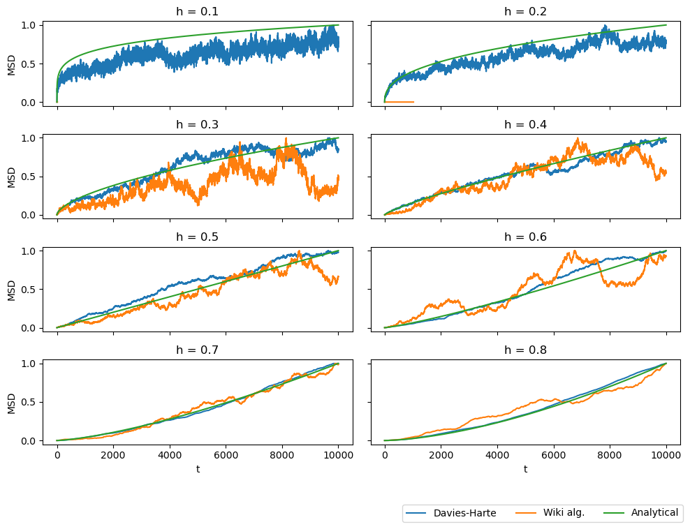

```python
import sys
sys.path.append("../src/")
import utils as ut
import fBm_stats as fbms
import matplotlib.pyplot as plt

data_path = "../data/"
h_s = [0.1, 0.2, 0.3, 0.4, 0.5, 0.6, 0.7, 0.8]
```


```python
fig, ax = plt.subplots(int(len(h_s)/2), 2, sharex = True, sharey = True, figsize = (10,7))
col = 0
row = 0
for h in h_s:
    df_dh = ut.read_hdf5_data(data_path + f"fBm_dh-h-{h}-100.hdf5").set_index("t")
    df_in = ut.read_hdf5_all(h, data_path, 1, 10).set_index("t")
    msd_dh = fbms.msd(df_dh)
    msd_in = fbms.msd(df_in)
    
    t = df_in.index
    msd_anal = t**(2*h)
    msd_anal = msd_anal/max(msd_anal)
    
    axi = ax[row][col]

    axi.plot(t,msd_dh, label = "Davies-Harte")
    axi.plot(t,msd_in, label = "Wiki alg.")
    axi.plot(t,msd_anal, label = "Analytical")
    axi.set_title(f"h = {h}")
    
    if row == len(h_s)/2 - 1: axi.set_xlabel("t")

    if col == 1: row += 1; col = 0
    else: col += 1; axi.set_ylabel("MSD")


fig.tight_layout()
handles, labels = ax[0][0].get_legend_handles_labels()
fig.legend(handles, labels, bbox_to_anchor = (0.99, -0.03), ncol = len(h_s)/2)

```

    100%|██████████| 10/10 [00:00<00:00, 1758.40it/s]
    100%|██████████| 10/10 [00:00<00:00, 1786.94it/s]
    100%|██████████| 10/10 [00:00<00:00, 1732.47it/s]
    100%|██████████| 10/10 [00:00<00:00, 1769.08it/s]
    100%|██████████| 10/10 [00:00<00:00, 1820.60it/s]
    100%|██████████| 10/10 [00:00<00:00, 1754.50it/s]
    100%|██████████| 10/10 [00:00<00:00, 1803.30it/s]
    100%|██████████| 10/10 [00:00<00:00, 1643.73it/s]


    <matplotlib.legend.Legend at 0x7f1a1376f250>


    

    

